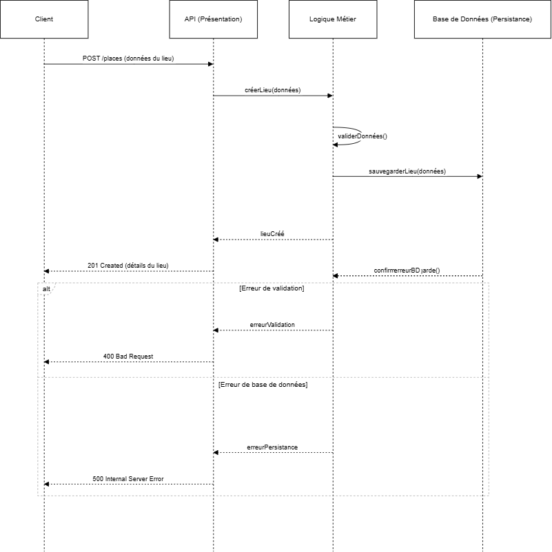
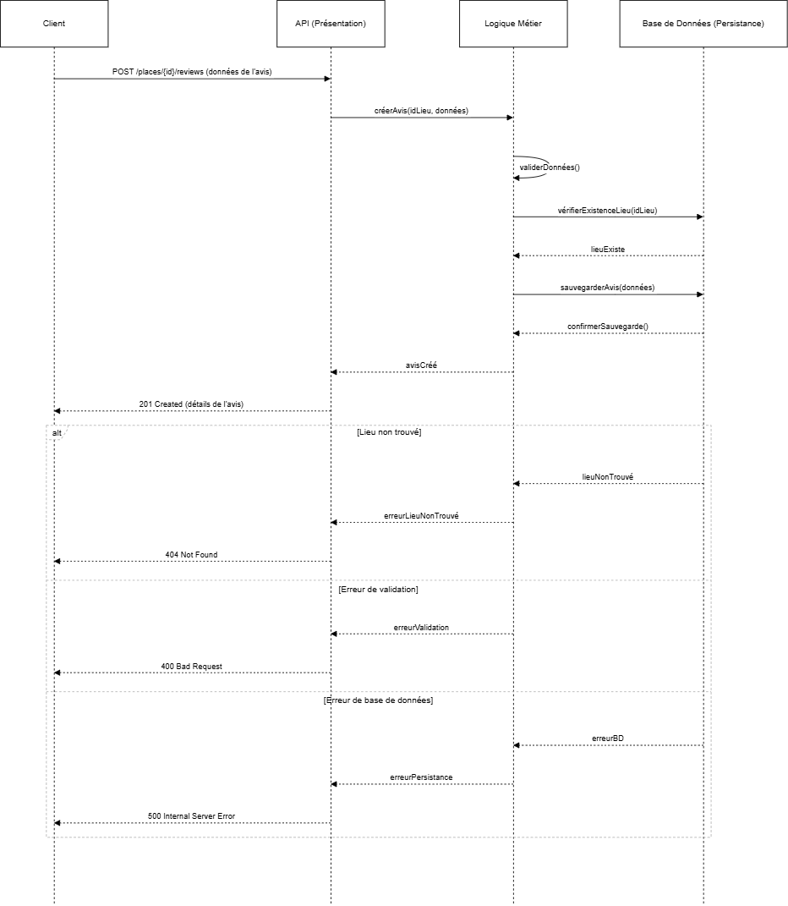
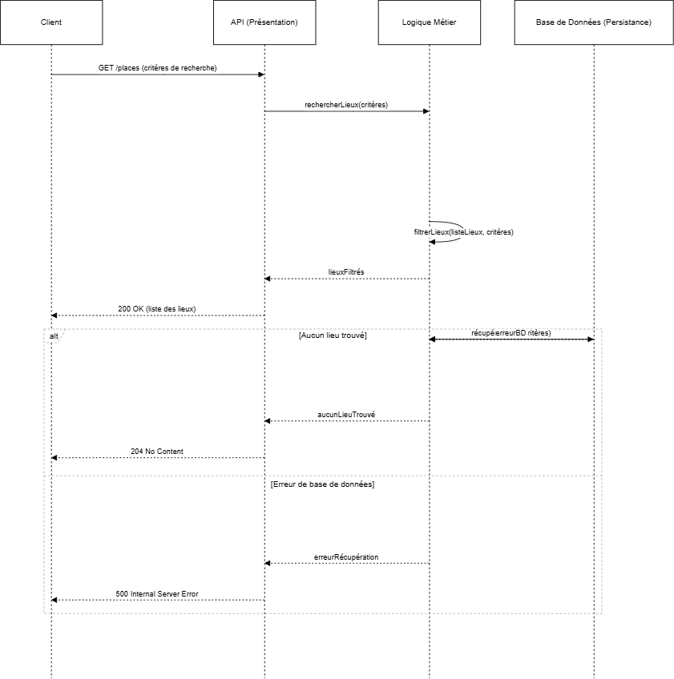

# 🚀 UML Diags 🚀 

## Diagram Package 📈

### Explanation 💡
This diagram shows how the different layers of the application are organized and interact with each other.

### Lexicon 📜

#### PresentationLayer : Manages the user interface and interactions
* UserController = Handles operations related to users
* PlaceController = Handles operations related to places
* ReviewController = Handles operations related to reviews
* AmenityController = Handles operations related to amenities

#### BusinessLogicLayer : Contains the main logic of the application
* ApplicationFacade = Simplified interface for the presentation layer

#### Services : Provides specific services for each entity
* UserService = Manages business logic for users
* PlaceService = Manages business logic for places
* ReviewService = Manages business logic for reviews
* AmenityService = Manages business logic for amenities

#### PersistenceLayer : Manages data storage and retrieval
* UserRepository = Handles access to user data
* PlaceRepository = Handles access to place data
* ReviewRepository = Handles access to review data
* AmenityRepository = Handles access to amenity data

## Diagram class 📈

### Explanation 💡
Class diagram illustrates the structure of a system by showing classes, their attributes, operations, and the relationships between them.
### Lexicon 📜

#### Classes
* BaseModel: Parent class for all entities
* User: Represents application users
* Place: Represents accommodations
* Review: Represents user reviews for places
* Amenity: Represents features or services of places
#### Attributes
* Characteristics of each class (e.g., first_name, price, rating)
* Denoted by + for public visibility
#### Methods
* Operations that can be performed on class instances (e.g., register(), update())
* Also denoted by + for public visibility
#### Relationships
* Inheritance: Shown by an arrow from child to parent (e.g., User to BaseModel)
* Association: Shown by a line between classes (e.g., User to Place)
* Multiplicity: Numbers or symbols near line ends (e.g., "1" and "*")

## 📈 Diag sequence 📈

### user registration 📈
![alt text][def]

#### Explanation 💡
This diagram illustrates the user registration process. The request goes through the API, is validated by the business layer, and then saved in the database. Error cases are also handled.
#### Lexicon 📜
* Client: The user or application that initiates the registration.

* API (Presentation): The entry point that receives the request from the client.

* Business Logic: The part that processes the rules and logic of the application.

* Database (Persistence): Where the user's data is stored.

* POST /users: The HTTP method used to send the registration data.

* createUser(): Function to initiate the creation of a new user.

* validateData(): Verification that the information provided is correct and complete.

* saveUser(): Saving the user's data in the database.

* 201 Created: HTTP status code indicating that registration was successful.

* 400 Bad Request: Error code for invalid data.

* 500 Internal Server Error: Error code for a server-side problem.

## Creation of a Place 📈

### Explanation 💡
This diagram illustrates the process of creating a new place. The request is processed by the API, validated by the business logic, then saved in the database. Error scenarios are also taken into account.
### Lexicon 📜
* Client: The user or application initiating the place creation.

* API (Presentation): The entry point receiving the client's request.

* Business Logic: The component processing application rules and logic.

* Database (Persistence): Where place data is stored.

* POST /places: HTTP method used to send place data.

* createPlace(): Function initiating the creation of a new place.

* validateData(): Verification of provided information's correctness and completeness.

* savePlace(): Saving place data in the database.

* 201 Created: HTTP status code indicating successful place creation.

* 400 Bad Request: Error code for invalid data.

* 500 Internal Server Error: Error code for server-side issues.

* confirmSave(): Database confirmation of successful data storage.

* placeCreated: Confirmation message of successful place creation.

* validationError: Error message for data validation issues.

* dbError: Error message for database-related problems.
## Submission of a Review 📈

### Explanation 💡
This diagram shows the process of submitting a review for a specific place. It includes verifying the existence of the place before saving the review. Various error scenarios are also handled.
### Lexicon 📜
* Client: The user or application submitting the review.

* API (Presentation): The entry point receiving the client's request.

* Business Logic: The component processing application rules and logic.

* Database (Persistence): Where place and review data are stored.

* POST /places/{id}/reviews: HTTP method used to send review data for a specific place.

* createReview(): Function initiating the creation of a new review.

* validateData(): Verification of provided review information.

* verifyPlaceExistence(): Checking if the specified place exists in the database.

* saveReview(): Saving review data in the database.

* 201 Created: HTTP status code indicating successful review creation.

* 404 Not Found: Error code when the specified place doesn't exist.

* 400 Bad Request: Error code for invalid review data.

* 500 Internal Server Error: Error code for server-side issues.

* placeExists: Confirmation that the specified place exists.

* reviewCreated: Confirmation message of successful review creation.

* placeNotFound: Error message when the place doesn't exist.

* validationError: Error message for data validation issues.

* dbError: Error message for database-related problems.
## Retrieval of a List of Places 📈

### Explanation 💡
This diagram illustrates the process of retrieving a list of places based on specific criteria. It shows how the request is processed through different layers, including the filtering of results in the business layer. Cases where no places are found or a database error occurs are also handled.
### Lexicon 📜
* Client: The user or application requesting the list of places.

* API (Presentation): The entry point receiving the client's request.

* Business Logic: The component processing application rules and logic.

* Database (Persistence): Where place data is stored.

* GET /places: HTTP method used to request places with search criteria.

* searchPlaces(): Function to initiate the search for places based on criteria.

* retrievePlaces(): Function to fetch places from the database.

* filterPlaces(): Process of refining the list of places based on criteria.

* 200 OK: HTTP status code indicating successful retrieval of places.

* 204 No Content: HTTP status code indicating no places were found.

* 500 Internal Server Error: Error code for server-side issues.

* placeList: The initial list of places retrieved from the database.

* filteredPlaces: The final list of places after applying filters.

* emptyList: Indicates that no places were found in the database.

* noPlacesFound: Message indicating that no places match the criteria.

* dbError: Error message for database-related problems.

* retrievalError: Message indicating an error in retrieving places.
# 📖 HBnB General Glossary 📖

## Core Concepts 🧠
* Layered Architecture: An architectural pattern that organizes an application into distinct layers (Presentation, Business Logic, Persistence), each with specific responsibilities.
* Facade Pattern: A design pattern that provides a simplified, unified interface to a set of interfaces in a subsystem, promoting loose coupling between layers.
* UML (Unified Modeling Language): A standardized modeling language used to create diagrams representing the structure and behavior of software systems.
* API (Application Programming Interface): A set of protocols and tools for building software applications, specifying how software components should interact.
* CRUD Operations: Basic data operations (Create, Read, Update, Delete) performed on entities within the system.
## Key Entities 🔑
* User: Represents an application user, with attributes like first_name, last_name, email, and password.
* Place: Represents a property or accommodation listing, with attributes like title, description, price, latitude, and longitude.
* Review: Represents a user's review of a place, including a rating and comment.
* Amenity: Represents a feature or service offered at a place, with attributes like name and description.
* BaseModel: A base class providing common attributes (id, created_at, updated_at) and methods for all entities.
## Layers 🧱
* Presentation Layer: Handles user interaction, including services and API endpoints. Often interacts with the Business Logic Layer.
* Business Logic Layer: Contains the core logic and models representing entities. Enforces business rules and interacts with the Persistence Layer.
* Persistence Layer: Manages data storage and retrieval, interacting directly with the database.
## Diagram Types 📈
* Package Diagram: A high-level diagram showing the organization of the application into packages (layers) and dependencies between them.
* Class Diagram: A detailed diagram representing the structure of classes, their attributes, methods, and relationships (inheritance, association, composition).
* Sequence Diagram: A diagram illustrating the interaction between objects over time, showing the sequence of messages exchanged during a specific use case or API call.
## Common Attributes & Methods 🔧
* id (UUID): A universally unique identifier for each entity.
* created_at: Timestamp indicating when the entity was created.
* updated_at: Timestamp indicating when the entity was last updated.
* create(): Method to create a new entity.
* update(): Method to update an existing entity.
* delete(): Method to remove an entity.
* list(): Method to retrieve a list of entities.
## UML Symbols ♾️
* '<<Interface>>' : Stereotype indicating an interface.
* '+' : Indicates public visibility of attributes or methods.
* '-->' : Association relationship between classes.
* '--|>' : Inheritance relationship (generalization).
* 'o--' : Composition relationship.
## General Terms 📚
* Repository: A component in the Persistence Layer responsible for data access and management.
* DTO (Data Transfer Object): An object used to transfer data between layers or components.
* ORM (Object-Relational Mapping): A technique that maps objects to database tables, simplifying data access.
* Endpoint: A specific URL in an API that handles a particular request.
### This lexicon should help in understanding the terminology used throughout the HBnB Evolution project documentation and provide a clear reference point for developers and stakeholders.

[def]: diag.sequence.1.drawio.png